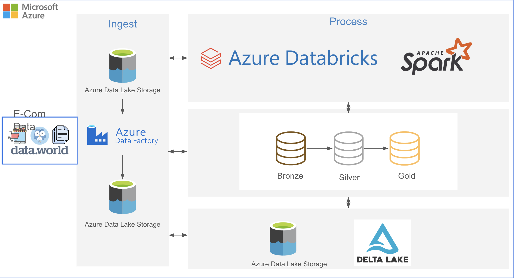

# E-Commerce Analytics Lakehouse Pipeline on Azure


## Overview
This project implements a **data lakehouse pipeline** for **E-commerce analytics** using Azure services and the **Medallion Architecture** (Bronze → Silver → Gold). The pipeline ingests raw datasets, incrementally refines them into analytics-ready data, and visualizes insights using dashboards.

### Key Azure Components:
- **Azure Data Factory (ADF)** – Orchestrates ingestion from external sources (e.g., `data.world`) into Azure Data Lake.
- **Azure Data Lake Storage Gen2 (ADLS)** – Stores raw and processed data in Landing Zones.
- **Azure Databricks (Apache Spark)** – Handles scalable transformations across Medallion layers.
- **Delta Lake** – Stores Bronze, Silver, and Gold layer data with ACID transactions and Time Travel.
- **Databricks SQL** – Runs queries and builds interactive dashboards.

---

## Architecture




## 🔄 Workflow Overview

The pipeline follows a **two-zone Azure Data Lake** + **Medallion Architecture (Bronze → Silver → Gold)** pattern:

### **1️⃣ Ingestion – Bronze Layer**
- **Landing Zone 1 (LZ1):** Stores **raw datasets** (`users`, `buyers`, `sellers`, `countries`).
- **Triggers:**
  - **Event-based** (Blob Event Trigger) for **users** → near real-time ingestion.
  - **Scheduled weekly** for reference data (`buyers`, `sellers`, `countries`).
- **Post-ingestion:** Raw files moved to **Landing Zone 2 / to_process_data**.

---

### **2️⃣ Transformation – Silver & Gold Layers**
- **Bronze → Silver:**
  - Data cleaning, schema enforcement, validation, deduplication.
  - Integration with reference data.
- **Silver → Gold:**
  - Aggregations, enrichment, and creating **business-ready fact tables**.
  - Example: `ecom_one_big_table` with user, buyer/seller, and country insights.

---

### **3️⃣ Storage – Delta Lake**
- All layers stored in **Delta format** for:
  - **ACID transactions** & **schema enforcement**.
  - **Versioning & Time Travel**.
- Optimized for **fast analytics**.

---

### **4️⃣ Consumption – Analytics**
- **Databricks SQL** queries on Gold tables.
- **Interactive dashboards** with:
  - Filters (e.g., Country, Date)
  - KPIs
  - Charts for Buyers, Sellers, Products Sold
---

## Automation & Orchestration
- **ADF Pipelines & Triggers**
  - Event trigger for `user_data`.
  - Scheduled trigger for `buyers`, `sellers`, `countries`.
- **Databricks Jobs**
  - Runs transformation notebooks automatically.
- **Error Handling & Monitoring**
  - ADF alerts for failed runs.
  - Delta ACID transactions prevent partial writes.

---

## Example SQL Queries
```sql
-- Top 5 Countries by Number of Buyers
SELECT Country, COUNT(DISTINCT BuyerID) AS TotalBuyers
FROM gold.ecom_one_big_table
GROUP BY Country
ORDER BY TotalBuyers DESC
LIMIT 5;

-- Buyers vs. Sellers by Country
SELECT Country,
       SUM(CASE WHEN UserType = 'Buyer' THEN 1 ELSE 0 END) AS Buyers_Count,
       SUM(CASE WHEN UserType = 'Seller' THEN 1 ELSE 0 END) AS Sellers_Count
FROM gold.ecom_one_big_table
GROUP BY Country;
```

---

## Repository Structure
```
├── notebooks/                # Databricks notebooks for ETL
├── pipelines/                # ADF pipeline JSON exports
├── sql/                      # SQL query files
├── images/                   # Architecture diagrams & screenshots
├── docs/                     # Additional documentation
└── README.md                 # Project documentation
```

---

## Deployment Guide
### Prerequisites
- Azure Subscription
- ADLS Gen2 Storage account (with hierarchical namespace enabled)
- Azure Data Factory instance
- Azure Databricks workspace
- Databricks cluster with ADLS access

### Steps
1. **Provision Resources** in Azure (Storage, ADF, Databricks).
2. **Create Containers** in ADLS: `landing-zone-1` and `landing-zone-2`.
3. **Set Up ADF Pipelines** with triggers for user and reference data ingestion.
4. **Import Databricks Notebooks** for Bronze → Silver → Gold transformations.
5. **Configure Databricks Job** to automate transformations.
6. **Register Gold Tables** in Databricks SQL and build dashboard.

---

## Conclusion
This project delivers an **end-to-end, automated, and scalable data engineering solution** for e-commerce analytics, leveraging Azure's modern data stack. It ensures **data quality, reliability, and real-time insights**, making it extensible for future analytics and machine learning use cases.
