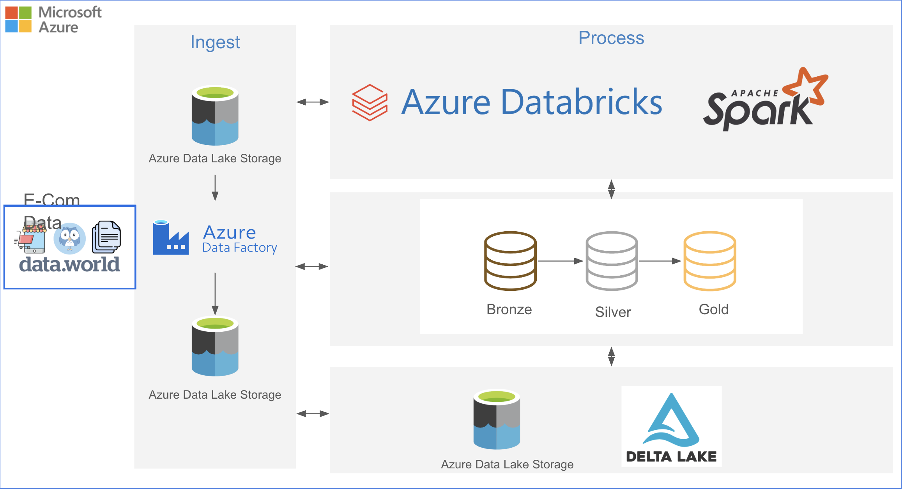
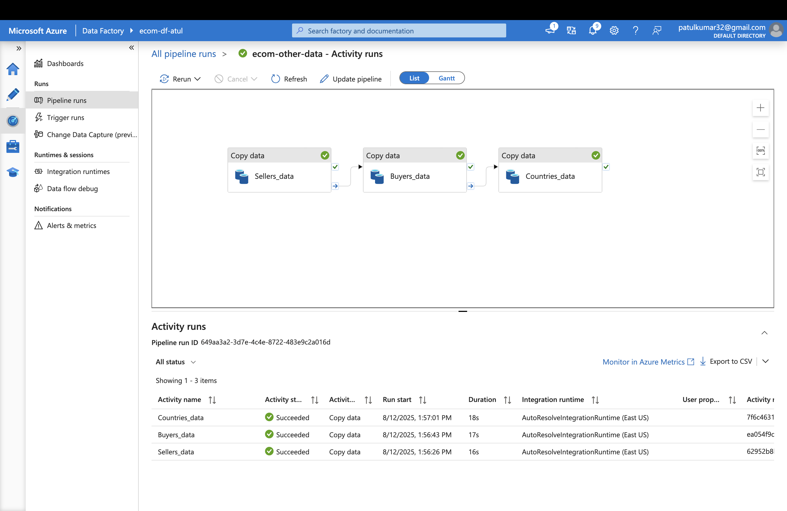
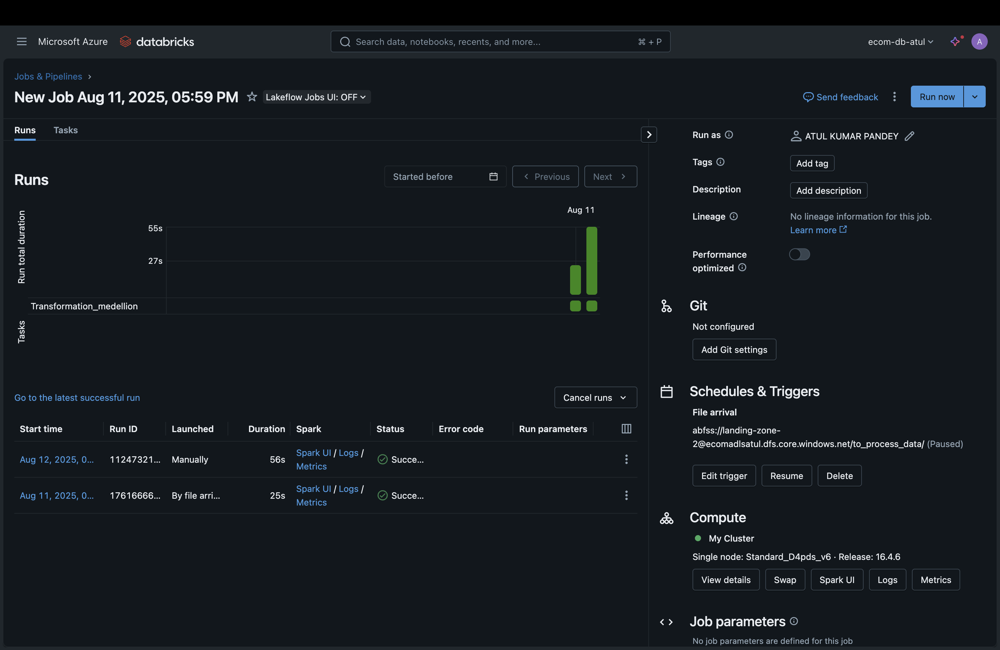

# E-Commerce Analytics Lakehouse Pipeline on Azure


## Overview
This project implements a **data lakehouse pipeline** for **E-commerce analytics** using Azure services and the **Medallion Architecture** (Bronze → Silver → Gold). The pipeline ingests raw datasets, incrementally refines them into analytics-ready data, and visualizes insights using dashboards.

### Key Azure Components:
- **Azure Data Factory (ADF)** – Orchestrates ingestion from external sources (e.g., `data.world`) into Azure Data Lake.
- **Azure Data Lake Storage Gen2 (ADLS)** – Stores raw and processed data in Landing Zones.
- **Azure Databricks (Apache Spark)** – Handles scalable transformations across Medallion layers.
- **Delta Lake** – Stores Bronze, Silver, and Gold layer data with ACID transactions and Time Travel.
- **Databricks SQL** – Runs queries and builds interactive dashboards.

---

## Architecture



---

## 🔄 Workflow Overview

The pipeline follows a **two-zone Azure Data Lake** + **Medallion Architecture (Bronze → Silver → Gold)** pattern:

### 1. Ingestion Layer (Bronze)
- **Source**: E-commerce datasets from data.world
- **Trigger Types**:
  - Event-based for user data (real-time processing)
  - Weekly scheduled for reference data (buyers, sellers, countries)
- **Storage**: Raw parquet files stored in Delta format with minimal processing
- **Location**: `/mnt/lz2/delta/tables/bronze/`

---

### 2. Transformation Layer (Silver)
Comprehensive data cleaning and standardization:

**Users Table Transformations:**
- Country code normalization to uppercase
- Language mapping (EN → ENGLISH, FR → FRENCH)
- Gender standardization and data entry error correction
- Civility title cleaning using regex patterns
- Account age categorization (New, Intermediate, Experienced)
- Boolean type casting for app usage indicators
- Social metrics data type optimization

**Buyers Table Transformations:**
- Integer and decimal type casting for metrics
- Country name standardization with proper casing
- Female-to-male buyer ratio calculations
- Wishlist-to-purchase ratio analysis
- High engagement flagging based on purchase behavior

**Sellers Table Transformations:**
- Comprehensive data type casting for all metrics
- Seller categorization by volume (Small, Medium, Large)
- Performance indicators calculation
- Pass rate analysis and missing value handling

**Countries Table Transformations:**
- Seller performance ratio calculations
- Gender distribution analysis
- Activity level categorization based on offline days
- High-performance country identification

---

### 3. Analytics Layer (Gold)
- **One Big Table (OBT)**: Comprehensive joined dataset combining all entities
- **Business Metrics**: Pre-calculated KPIs and ratios
- **Optimized Structure**: Analytics-ready format for fast querying

---

### 4. Storage – Delta Lake**
- All layers stored in **Delta format** for:
  - **ACID transactions** & **schema enforcement**.
  - **Versioning & Time Travel**.
- Optimized for **fast analytics**.

---

### 5. Consumption – Analytics**
- **Databricks SQL** queries on Gold tables.
- **Interactive dashboards** with:
  - Filters (e.g., Country, Date)
  - KPIs
  - Charts for Buyers, Sellers, Products Sold

---

## Automation & Orchestration
- **ADF Pipelines & Triggers**
  - Event trigger for `user_data`.
  - Scheduled trigger for `buyers`, `sellers`, `countries`.
- **Databricks Jobs**
  - Runs transformation notebooks automatically.
- **Error Handling & Monitoring**
  - ADF alerts for failed runs.
  - Delta ACID transactions prevent partial writes.

---

## 📷 Screenshots & Workflow Proof

### 1. Azure Data Factory Pipeline

Event-triggered and scheduled pipelines orchestrating data ingestion from `data.world` to Azure Data Lake.

### 2. Databricks Job Run Success

Successful run showing all tasks completed without errors.

---

## Example SQL Queries

```sql
-- Top 5 Countries by Number of Buyers
SELECT Country, COUNT(DISTINCT BuyerID) AS TotalBuyers
FROM gold.ecom_one_big_table
GROUP BY Country
ORDER BY TotalBuyers DESC
LIMIT 5;

-- Buyers vs. Sellers by Country
SELECT Country,
       SUM(CASE WHEN UserType = 'Buyer' THEN 1 ELSE 0 END) AS Buyers_Count,
       SUM(CASE WHEN UserType = 'Seller' THEN 1 ELSE 0 END) AS Sellers_Count
FROM gold.ecom_one_big_table
GROUP BY Country;
```

---

## 🔧 Configuration

### Environment Variables
```bash
# Azure Storage Configuration
AZURE_STORAGE_ACCOUNT=your_storage_account
AZURE_STORAGE_CONTAINER=landing-zone-2
AZURE_CLIENT_ID=your_client_id
AZURE_CLIENT_SECRET=your_client_secret
AZURE_TENANT_ID=your_tenant_id

# Databricks Configuration
DATABRICKS_HOST=your_databricks_host
DATABRICKS_TOKEN=your_access_token
```
---

### Mount Configuration
The pipeline uses Azure Data Lake Storage mounting for efficient data access:

```python
# Storage mount configuration in Databricks
configs = {
    "fs.azure.account.auth.type": "OAuth",
    "fs.azure.account.oauth.provider.type": "org.apache.hadoop.fs.azurebfs.oauth2.ClientCredsTokenProvider",
    "fs.azure.account.oauth2.client.id": "your_client_id",
    "fs.azure.account.oauth2.client.secret": "your_client_secret",
    "fs.azure.account.oauth2.client.endpoint": "https://login.microsoftonline.com/your_tenant_id/oauth2/token"
}
```

---

## 📊 Data Schema

### Users Table (Silver Layer)
| Column | Type | Description |
|--------|------|-------------|
| identifier | string | Unique user identifier |
| country | string | User country (normalized) |
| gender | string | User gender (standardized) |
| language_full | string | Full language name |
| account_age_group | string | Account maturity category |
| hasAnyApp | boolean | Mobile app usage indicator |
| socialNbFollowers | integer | Social media followers count |
| user_descriptor | string | Combined user profile string |

### Buyers Table (Silver Layer)
| Column | Type | Description |
|--------|------|-------------|
| country | string | Country name |
| buyers | integer | Total buyers count |
| femalebuyers | integer | Female buyers count |
| malebuyers | integer | Male buyers count |
| female_to_make_ratio | decimal | Gender distribution ratio |
| high_engagement | boolean | High engagement flag |

---

## Repository Structure
```
├── notebooks/                # Databricks notebooks for ETL
├── pipelines/                # ADF pipeline JSON exports
├── sql/                      # SQL query files
├── images/                   # Architecture diagrams & screenshots
├── docs/                     # Additional documentation
└── README.md                 # Project documentation
```

---

## Deployment Guide
### Prerequisites
- Azure Subscription
- ADLS Gen2 Storage account (with hierarchical namespace enabled)
- Azure Data Factory instance
- Azure Databricks workspace
- Databricks cluster with ADLS access

### Steps
1. **Provision Resources** in Azure (Storage, ADF, Databricks).
2. **Create Containers** in ADLS: `landing-zone-1` and `landing-zone-2`.
3. **Set Up ADF Pipelines** with triggers for user and reference data ingestion.
4. **Import Databricks Notebooks** for Bronze → Silver → Gold transformations.
5. **Configure Databricks Job** to automate transformations.
6. **Register Gold Tables** in Databricks SQL and build dashboard.

---

## Conclusion
This project delivers an **end-to-end, automated, and scalable data engineering solution** for e-commerce analytics, leveraging Azure's modern data stack. It ensures **data quality, reliability, and real-time insights**, making it extensible for future analytics and machine learning use cases.
